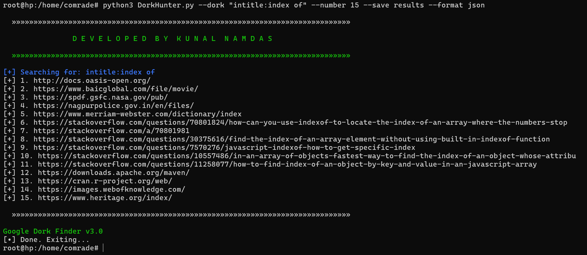

# DorkHunter

DorkHunter is a powerful tool for performing Google Dork searches. It allows you to automate the process of finding specific types of information on websites using Google Dorks. With DorkHunter, you can save results in multiple formats, send them via email, and customize your search queries.

# DEVELOPER

#### Kunal Namdas


### DorkHunter image


## Features

- Perform Google Dork searches
- Save results in TXT, CSV, JSON, or HTML formats
- Send search results via email
- Custom User-Agent support
- Verbose mode for detailed output

## Requirements

- Python 3.6+
- Required Python packages (see installation instructions below)

## Installation

1. Clone the repository:

   ```bash
   git clone https://github.com/kunalnamdas/DorkHunter.git
   cd DorkHunter
pip install -r requirements.txt

## Usage

python DorkHunter.py [OPTIONS]
Options

--dork : Google dork query to search

--dorks_file : File containing multiple dork queries

--domain : Specific domain to search within

--number : Number of search results to display (default: 10)

--save : File name to save the results

--format : Format to save the results (txt, csv, json, html)

--email : Email address to send results

--smtp_server : SMTP server for sending emails

--smtp_port : SMTP server port (default: 587)

--smtp_user : SMTP username (email address)

--smtp_pass : SMTP password or app-specific password

--verbose : Enable verbose mode

--user_agent : Custom User-Agent (default: "Mozilla/5.0 (Windows NT 10.0; Win64; x64) AppleWebKit/537.36 (KHTML, like Gecko) Chrome/91.0.4472.124 Safari/537.36")


#### Perform a Google Dork Search and Display Results
python   DorkHunter.py --dork "intitle:index of" --number 5

#### Perform a Google Dork Search and Save Results in TXT Format
python   DorkHunter.py --dork "intitle:index of" --number 5 --save results --format txt

#### Perform a Google Dork Search and Save Results in CSV Format
python   DorkHunter.py --dork "intitle:index of" --number 5 --save results --format csv

#### Perform a Google Dork Search and Save Results in JSON Format
python   DorkHunter.py --dork "intitle:index of" --number 5 --save results --format json

#### Perform a Google Dork Search and Save Results in HTML Format
python   DorkHunter.py --dork "intitle:index of" --number 5 --save results --format html

#### Perform a Google Dork Search for a Specific Domain
python   DorkHunter.py --dork "intitle:index of" --number 5 --domain example.com

#### Perform a Google Dork Search with Verbose Output
python   DorkHunter.py --dork "intitle:index of" --number 5 --verbose

#### Perform a Google Dork Search Using a Custom User-Agent
python   DorkHunter.py --dork "intitle:index of" --number 5 --user_agent "CustomUserAgent/1.0"

#### Perform a Google Dork Search and Send Results via Email
python   DorkHunter.py --dork "intitle:index of" --number 5 --save results --format txt --email youremail@gmail.com --smtp_server smtp.gmail.com --smtp_port 587 --smtp_user youremail@gmail.com --smtp_pass yourpassword


## requirements.txt

googlesearch-python
google
requests
smtplib
email
argparse
logging
json
csv

## Thank You for Using DorkHunter!

Thank you for choosing DorkHunter to automate your Google Dork searches. We hope this tool helps you efficiently find the information you need on the web. Enjoy using DorkHunter! If you encounter any issues or have any suggestions, feel free to open an issue on GitHub!

